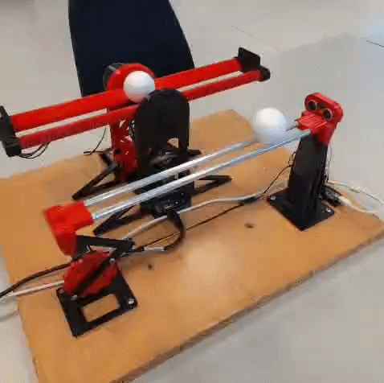
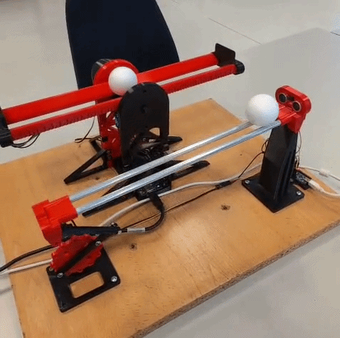

# Ce2Lab - Ball and Beam

The Ball and Beam system is a classic experiment widely used in control engineering to study PID control techniques. The objective of the system is to maintain a ball at a desired position along a beam by adjusting the beam's angle. This is achieved by continuously measuring the ball position and applying a PID control action to a servo motor that tilts the beam.

 

In this project, a different ATmega328P-based implementation of the Ball and Beam system is developed, using an ultrasonic and laser sensors to measure the ball's position and a servo motor to control the beam angle. A PID (Proportional–Integral–Derivative) controller is implemented to automatically adjust the beam inclination, keeping the ball close to the desired target position.

> **Note:** Process tested with Windows 11 with PlatformIO (VSC) on 8th April 2026.

## Ball and Beam GUI

A web interface is also available, allowing you to run simulations in HTML and connect to the actual model for direct interaction. Follow this [official site](Ball%20and%20Beam%20GUI/) to learn more.

 

Model 1

A “Ball and Beam” with its support in the center:

1. Materials and cost

### 3D printing of parts

A Prusa MK4 (0.4 mm nozzle) printer was used. The total printing time is: 7h 39min + 10h 28min + 14h 54min + 1h 34min = 34h 35 min. Parameters:
- Layer height: 0.15 mm
- First layer height: 0.2 mm
- Infill: 5 %
- Raft: No
- Supports: Yes
- Ironing: 15 mm/s

Printing material:

- PLA 1.75 mm
- Extruder temperature: 215 °C
- Bed temperature: 60 °C
- PLA consumption: 78.73 g + 102.63 g + 146.65 g + 13.52 g = 341.53 g (5%)

### Additional material

Mechanical components:
- 12 × M4 Allen screws
- 7 x Jumper Wire 
- 1 x Hot glue
- 1 x Ping-pong ball

Electronic components:
- 1 × ATMega328P (Microcontroller socket board): 10 €
- 1 × MG996r motor: 6 €
- 1 × 341.53 g of PLA roll: 6.50 € (19€/kg)
- 1 × VL53L0X: 1.0 €

### Cost per prototype

Total cost: 23.50 €

2. Assembly

If you're reusing the code, try connecting everything as shown in the image below:

Model 2

A “ball-and-beam” structure supported at one end (with the same model at the other end)

1. Materials and cost

### 3D printing of parts

A Prusa MK4 (0.4 mm nozzle) printer was used. The total printing time is: 12 h 27 min
- Layer height: 0.15 mm
- First layer height: 0.2 mm
- Infill: 5 %
- Raft: No
- Supports: Yes
- Ironing: 15 mm/s

Printing material

- PLA 1.75 mm
- Extruder temperature: 215 °C
- Bed temperature: 60 °C
- PLA consumption: 112.5 g (5%)

### Additional material

Mechanical components:
- 3 × M4 1 cm Allen screws
- 2 x M2 8 cm Allen screws
- 2 x M2 washers
- 1 x 7 mm hollow aluminum rod: 2 €

Electronic components:
- 1 × ATMega328P (Microcontroller SMD board): 3.3 €
- 1 × MG996r motor: 6 €
- 1 × 112.2 g of PLA roll: 2.20 € (19€/kg)
- 1 × HC-SR04: 2.5 €

### Cost per prototype

Total: 16 €

2. Assembly

If you're reusing the code, try connecting everything as shown in the image below:

