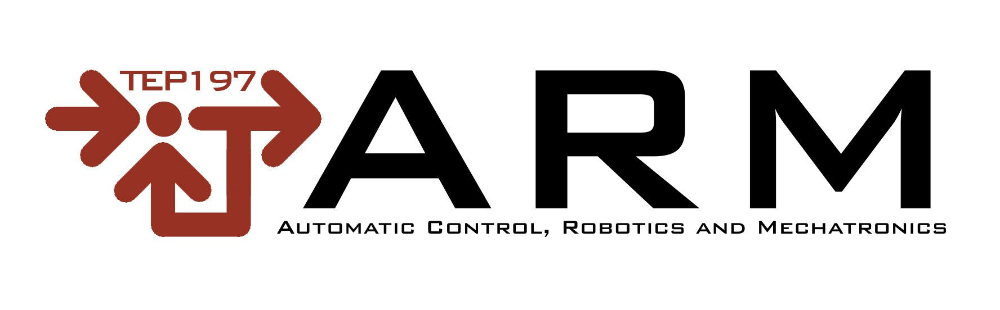

# Unlocking the Development and Experiences ofControl Education Labs (Ce2Lab) 

[](.)
[](https://doi.org/10.5281/zenodo.23079949)
[](LICENSE)

The shortage of physical lab models in university control engineering laboratories is a widely recognized problem at theinternational level. In response to this challenge, this paper presents CE2Labs (Unlocking the Development and Experiences ofControl Education Labs), a teaching innovation project funded by theIFAC Activity Fundand developed by an internationalteam of educators and laboratory engineers from universities in Spain, Sweden, France, Germany, and the United Kingdom.The project proposes the design and construction of low-cost, open-source physical lab models at different levels of complexity,ranging from 3D-printed mechanical devices to Arduino-based and custom electronics solutions, as well as the developmentof an open-access web platform where educators worldwide can access the materials and share experiences.


Visit the project [OFFICIAL website](https://arm.ual.es/ce2lab2/#) for more information. This work was carried out within the [Automation, Robotics and Mechatronics Group](https://arm.ual.es/arm-group/) (ARM TEP 197) at the University of Almería (Spain).

<a href="https://arm.ual.es/arm-group/"> 
   
</a>
<a href="https://www.linkedin.com/company/automatic-robotics-and-mechatronics-research-group/"> 
   
</a>

## 📑 Citation

**_Project article_**

```
@article{sanchez2026democratizando,
  title={Democratizando los laboratorios de control: la iniciativa CE2Labs},
  author={S{\'a}nchez, Jos{\'e} Luis Guzm{\'a}n and Gil, Juan Diego and Ca{\~n}adas-Ar{\'a}nega, Fernando and Pataro, Igor ML and Rodr{\'\i}guez-Miranda, Enrique and Gonz{\'a}lez-Her{\'a}ndez, Jos{\'e} and Mu{\~n}oz-Rodr{\'\i}guez, Manuel and Berenguel, Manuel},
  journal={Jornadas de Autom{\'a}tica},
  number={47},
  year={2026}
}
```

**_Ball and beam article_**

```
@article{aranega2026plataforma,
  title={Plataforma Ball and Beam de bajo coste como apoyo a la ense{\~n}anza de conceptos introductorios de modelado y control autom{\'a}tico},
  author={Ca{\~n}adas-Aranega,Fernando  and Pataro, Igor M.L. and Rodr{\'\i}guez, Enrique and Gil, Juan Diego and Luis Guzm{\'a}n, Jos{\'e}},
  journal={Jornadas de Autom{\'a}tica},
  number={47},
  year={2026}
}
```
**_Software citation_**
  
```
@software{c2d_project,
  author={Ca{\~n}adas-Aranega,Fernando  and Pataro, Igor M.L. and Rodr{\'\i}guez, Enrique and González, José and Muñoz, Manuel and Gil, Juan Diego and Luis Guzm{\'a}n, Jos{\'e}},
  title   = {Ce2Lab Repository Project},
  version = {0.0.1},
  year    = {2026},
  doi     = {https://doi.org/10.5281/zenodo.23079949},
  url     = {https://github.com/FerCanAra/Ce2Lab_ball_and_beam/tree/main}
}
```

## Ce2Lab - Watt Governor

This repository contains the STL files required to build a simple **Watt Governor demonstrator** for educational use. The objective of the model is to provide a **visual and intuitive demonstration** of how a centrifugal governor works. By rotating the central shaft manually, the user can observe how the rotating masses move outward as the rotational speed increases, causing the central collar to move vertically.

Go to [official site](Watt%20Governor/) for full details on the complete project.

## Ce2Lab - Ball and Beam

The Ball and Beam system is a classic experiment widely used in control engineering to study PID control techniques. The objective of the system is to maintain a ball at a desired position along a beam by adjusting the beam's angle. This is achieved by continuously measuring the ball position and applying a PID control action to a servo motor that tilts the beam.

Go to [official site](Ball%20and%20Beam/) for full details on the complete project.

## License

<details>
<summary>This project is licensed under the **BSD 3-Clause License**.</summary>

Copyright (c) 2026, Fernando Cañadas Aránega, Igor Mendes Lima Pataro, Enrique Rodríguez Miranda, José González Hernández, José Luis Guzmán Sánchez and Juan Diego Gil Vergel.

All rights reserved.

Redistribution and use in source and binary forms, with or without modification,
are permitted provided that the following conditions are met:

1. Redistributions of source code must retain the above copyright notice,
this list of conditions and the following disclaimer.

2. Redistributions in binary form must reproduce the above copyright notice,
this list of conditions and the following disclaimer in the documentation
and/or other materials provided with the distribution.

3. Neither the name of the copyright holders nor the names of its contributors
may be used to endorse or promote products derived from this software without
specific prior written permission.

THIS SOFTWARE IS PROVIDED BY THE COPYRIGHT HOLDERS AND CONTRIBUTORS "AS IS"
AND ANY EXPRESS OR IMPLIED WARRANTIES ARE DISCLAIMED.

For the complete license text see the `LICENSE` file in this repository.
</details>

## Contributor

[Fernando Cañadas Aránega](https://linktr.ee/fercanara), 
Igor Mendes Lima Pataro,
Enrique Rodríguez Miranda, 
José González Hernández,
[Jose Luis Guzman Sánchez](https://w3.ual.es/personal/joguzman/) and
[Juan Diego Gil Vergel](https://w3.ual.es/personal/jdgil/).

## References

Code template: [AntonAshraf](https://github.com/AntonAshraf/Ball-Beam-PID-Control/tree/main)

stl template: [OlegKor25](https://www.thingiverse.com/thing:6387659)
